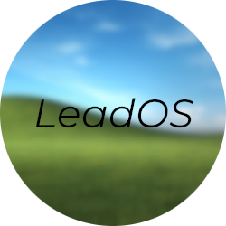

<h1 align="center">LeadOS 3D Printer Firmware</h1>

LeadOS is a project based on the [Marlin](https://github.com/MarlinFirmware/Marlin) 3D Printer Firmware, created by @LeadOn for his Ender 3 v2. First, the idea was to build their own firmware for fun, and adding cool features in it. But, one day, @Twixer, a friend of mine bought an Wanhao D12, and saw the aweful experience of not having an official firmware made by the company, but was developed by someone random in their community. But what's wrong about that you might say? Well, having closed source firmware is not cool at all, and this is why this project exists. Everyone should be in control of what's installed on their machine, especially if it's connected to the internet.

## Ender 3 - Fysetc Cheetah 1.2 - CR Touch & Creality Sprite Extruder

This branch is dedicated for the Ender 3, with the Fysetc Cheetah 1.2 board and BL Touch installed on it.

## Features

Here are all features present in this firmware :

- Based on Marlin 2.1.2.1
- BL Touch support
- Advanced Pause Feature enabled
- Multiplied probe speed
- Bilinear Bed Leveling
- Added Z Offset Wizard
- Added M73 G-Code (set current percentage)
- Enabled Babystepping
- S-Curve Acceleration enabled to reduce vibrations on stepper motors
- Bed Leveling and Tramming menus added, for manual and automatic leveling
- Added Host Action Commands and Host Prompt support to have full OctoPrint usages
- Many more!

## Building LeadOS

In order to build LeadOS, please follow official Marlin's documentation (here built using VS Code/PlatformIO). After that, follow flash procedure on [Fysetc's website](https://wiki.fysetc.com/Cheetah_Board/).

## Changelog

| Version                              | Release date | What's new     |
| ------------------------------------ | ------------ | -------------- |
| [2.1.2.1](https://valentinvirot.fr/) | 12/17/2023   | First release. |
