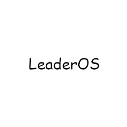

<h1 align="center">LeaderOS 3D Printer Firmware</h1>

## LeaderOS

LeaderOS is a project based on the [Marlin](https://github.com/MarlinFirmware/Marlin) 3D Printer Firmware, created by @LeadOn and @Twixer originally for their Ender 3 v2. First, the idea was to build their own firmware for fun, and adding cool features in it. But, one day, @Twixer bought an Wanhao D12, and saw the aweful experience of not having an official firmware made by the company, but was developed by someone random in their community. But what's wrong about that you might say? Well, having closed source firmware is not cool at all, and this is why this project exists. Everyone should be in control of what's installed on their machine, especially if it's connected to the internet.

## Releases

| Name                                    | Release date    | Version |
| --------------------------------------- | --------------- | ------- |
| Ender 3 v2 - CR Touch                   | 12/26/2022      | 2.1.2   |
| Ender 3 - Fysetc Cheetah 1.2 - BL Touch | 12/28/2022      | 2.1.2   |
| Wanhao D12 230 - DUAL - BL Touch        | En cours de Dev | 0.1     |
